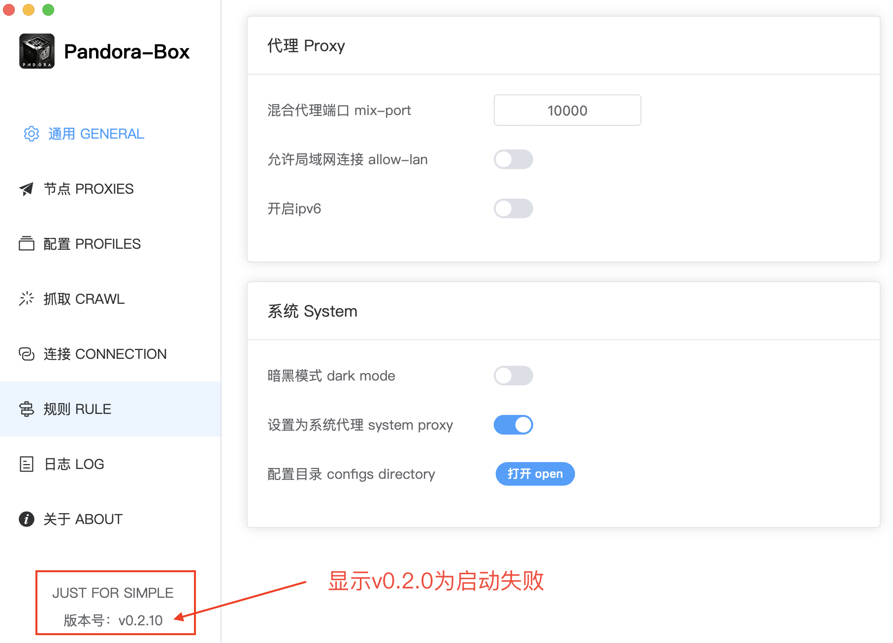
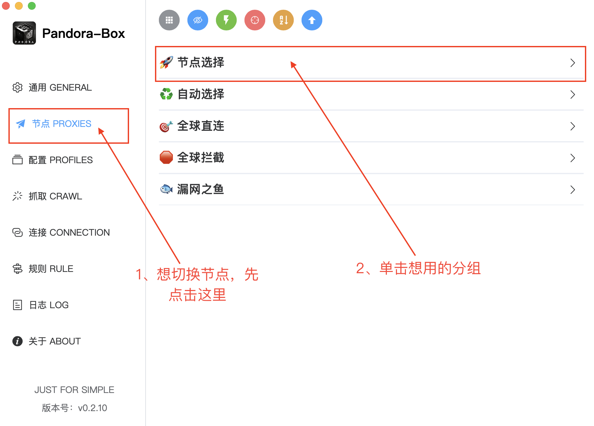

# Pandora-Box 基本使用

## 1、确认软件启动成功
确认方法：查看软件左下角显示的版本号，跟你下载的版本号一致
 若不显示v0.2.0为启动成功
 
## 2、点击配置导入订阅

## 3、选择想用的配置点击

## 4、切换分组节点

## 5、开启系统代理
开启系统代理后，打开浏览器输入谷歌地址，页面可以显示出来就OK了

## 6、抓取使用
**在抓取时先关闭Tun**,**在抓取时先关闭Tun**,**在抓取时先关闭Tun** 

 **抓取成功，回到配置页面，启用默认配置，即可切换使用抓取到的节点**

附：

  
点我展开看抓取类型介绍

  <pre><code>

### 1、抓取逻辑 Crawl Logic
- 节点可用
- 节点延迟在4s内
- 节点开启Tls
- 检测节点server字段是否为Cloudflare Ip, 如果为Cloudflare Ip则根据本机网络环境自动优选Cloudflare Ip后，新增一个节点到列表中 
- 抓取成功会更新默认配置
 
- Node available
- Node delay is within 4s
- Node enables Tls
- Detect whether the node server field is Cloudflare IP. If it is Cloudflare IP, Cloudflare IP will be automatically selected according to the local network environment and a new node will be added to the list.
- If the crawl is successful, the default profile will be updated.

### 2、抓取类型 Crawl Type
- clash订阅(clash subscription)
 一般用yaml编码
 Generally encoded in yaml

- v2ray订阅(v2ray subscription)
 一般用Base64编码
 Generally encoded in Base64

- 分享链接(share link)
 以下开头的文字视为分享链接
 Text starting with the following text is considered a share link.
 ss://...
 ssr://...
 vmess://...
 vless://...
 trojan://...
 tuic://...
 hysteria://...
 hysteria2://...

- 模糊抓取(fuzzy crawling)
 当内容包含订阅地址和共享链接时使用。
 Used when content contains subscription addresses and sharing links.
  </code></pre>

## 7、出现问题提issue，上传日志文件

