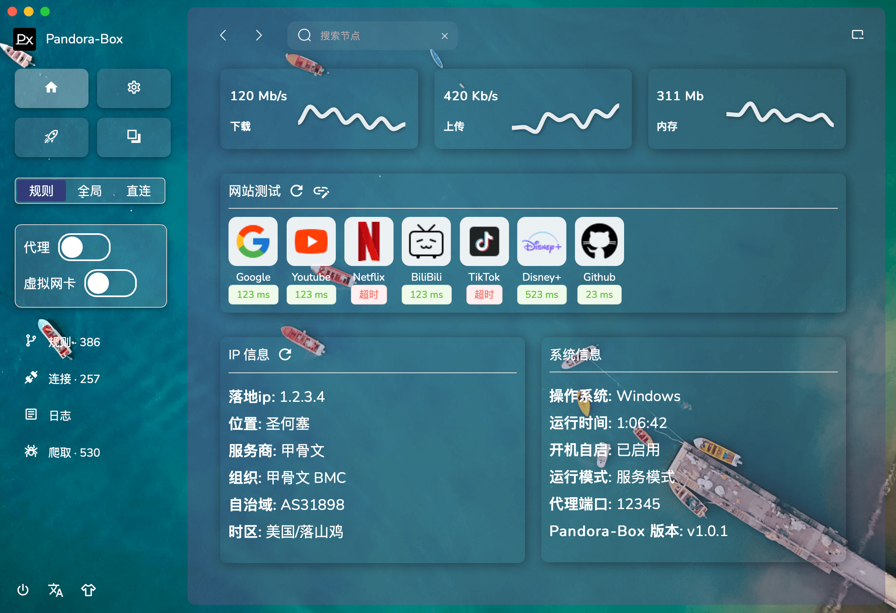
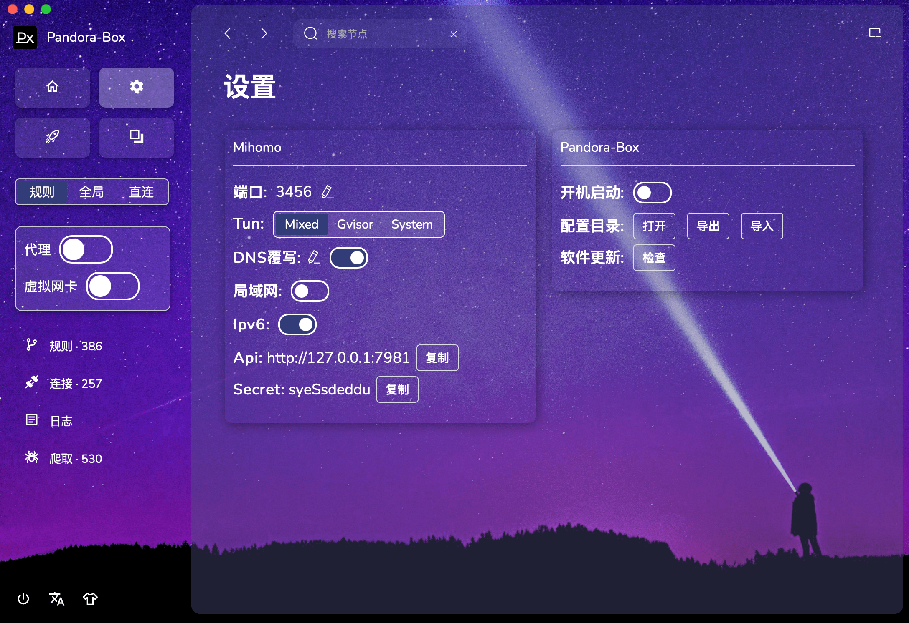
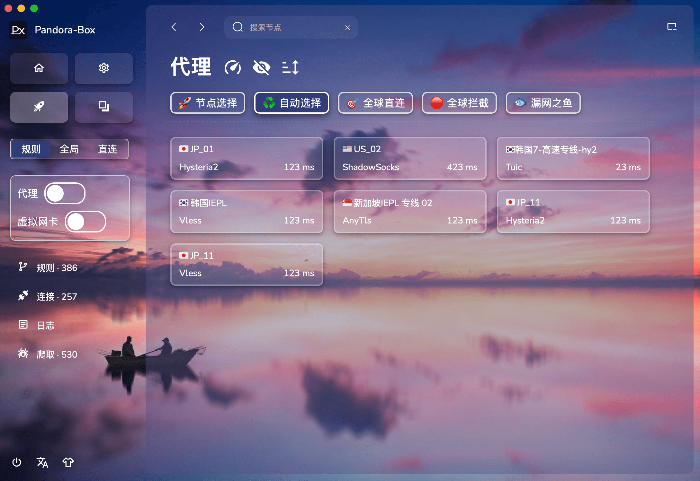
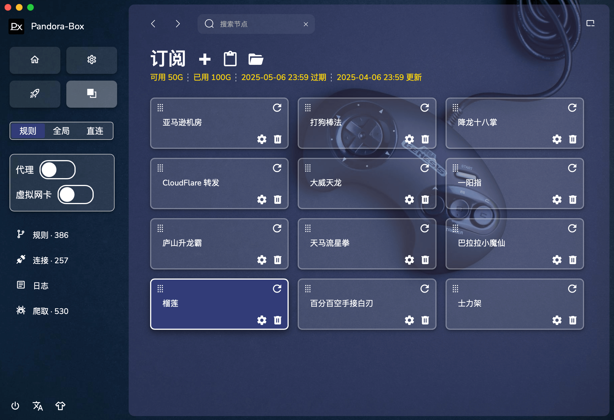

<div align="center">

<h1>Pandora-Box</h1>
<p>一个简易的 Mihomo 桌面客户端</p>
</div>

# 新版须知

[下载APP体验版](https://github.com/snakem982/Pandora-Box/releases/tag/v1.0.1-alpha)

## 功能特点

- 支持 本地 HTTP/HTTPS/SOCKS 代理
- 支持 Vmess, Vless, Shadowsocks, Trojan, Tuic, Hysteria, Hysteria2, Wireguard, Mieru 协议
- 支持 分享链接, 订阅链接, Base64格式，Yaml格式 的数据输入解析
- 内置将节点和订阅转换为 Mihomo 配置
- 自动添加极简规则分组以及防DNS泄露配置
- 支持统一所有订阅的规则和分组
- 支持Tun模式

## 支持的系统平台

- Windows 10/11 AMD64/ARM64
- MacOS 10.13+ AMD64
- MacOS 11.0+ ARM64
- Linux AMD64/ARM64

## 提示 Px 开启 TUN 需要授权
- 点击取消将以普通权限运行，不能开启Tun
- 点击继续将以管理员权限运行，可以开启Tun
- 按需选择即可

## 提示 Px 需要网络接入
- 点击 允许 即可

## macos 软件报错“损坏的文件”，处理办法

打开终端，输入以下命令，后面是app的具体路径，不知道？可以直接将app拖入终端即可看到路径

```shell
xattr -rd com.apple.quarantine Pandora-Box.app
```

## 新版的主要改进是什么

- 1、主要是界面改版，支持背景切换、语言切换、拖拽导入
- 2、顶部搜索当前配置节点，进行快速切换
- 3、增加最小化到托盘功能
- 4、统一规则，有适合轻量用户使用的 简约分组、多国别分组，以及重度用户使用的全分组 模板
- 5、暂时未将0.2版本的 爬取模块，导入导出模块 搬过来

## Todo 未来计划

- 爬取模块
- 导入导出模块
- 服务模式，开机自启
- Bug 修复

# 预览

| Tab | 新界面不同主题预览                           |
|-----|-------------------------------------|
| 主页  |         | 
| 设置  |      |
| 代理  |     | 
| 订阅  |  | 