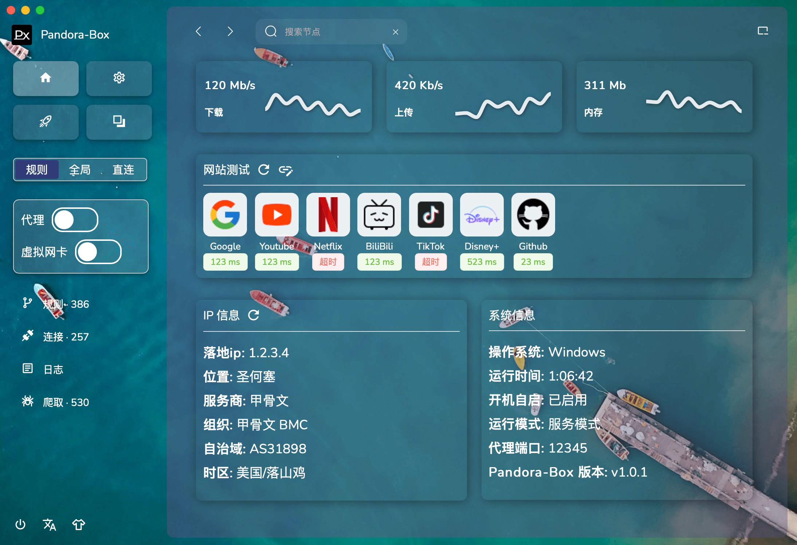
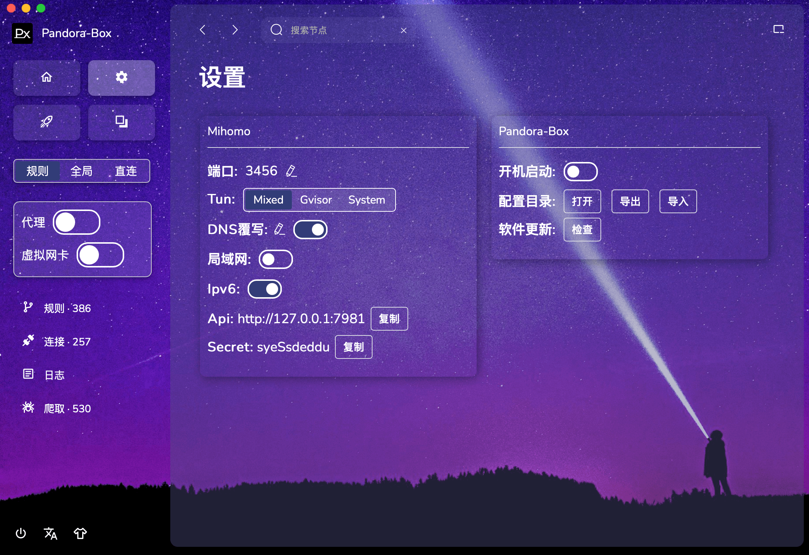
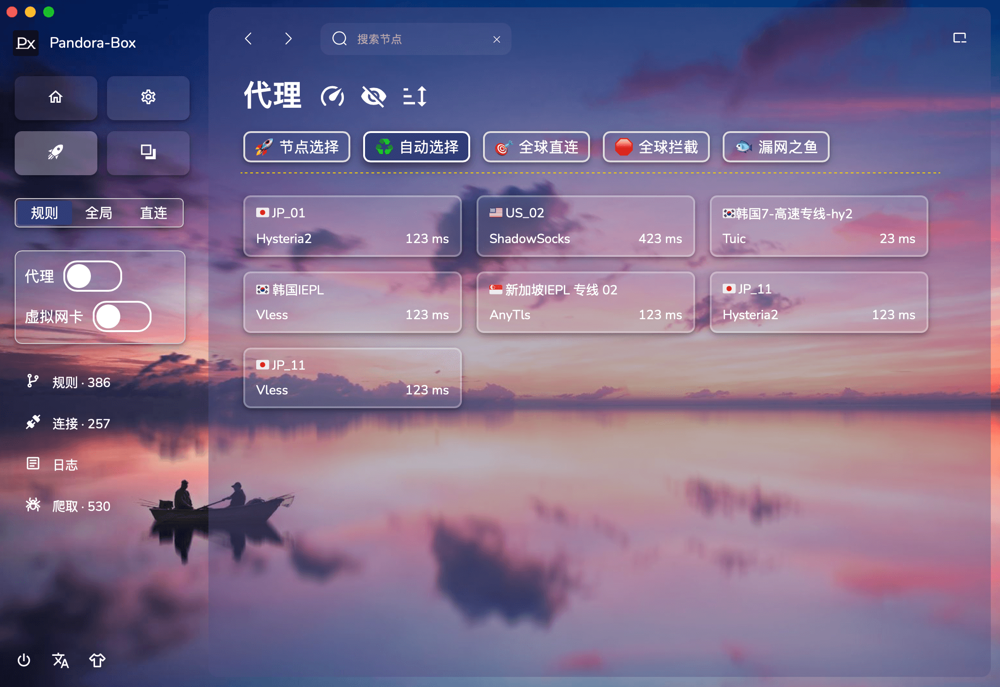
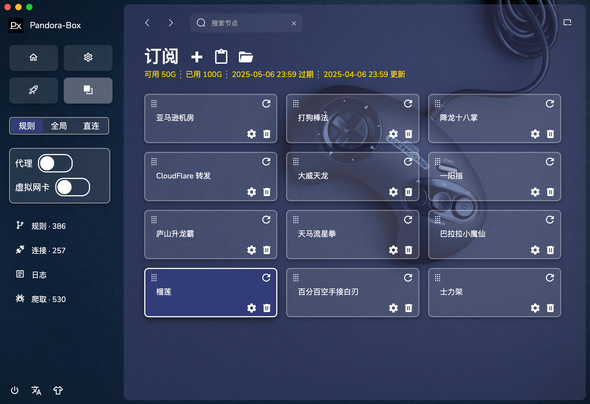

<div align="center">
  
  <h1>Pandora-Box</h1>
  <p>一个简易的 Mihomo 桌面客户端</p>
</div>

## 下载地址

[下载APP](https://github.com/snakem982/Pandora-Box/releases)

## 功能特点

- 支持本地 HTTP/HTTPS/SOCKS 代理
- 支持 Vmess, Vless, Shadowsocks, Trojan, Tuic, Hysteria, Hysteria2, Wireguard, Mieru 协议
- 支持分享链接、订阅链接、Base64 格式、Yaml 格式、Json 格式的数据解析
- 内置订阅转换，可将clash、v2ray、sing-box订阅转换为 mihomo 配置
- 对无规则订阅自动添加极简规则分组
- 开启 DNS 覆写可防止 DNS 泄露
- 支持统一所有订阅的规则和分组，支持自定义模版规则和分组
- 支持 TUN 模式 和 Smart 智能分组

## 支持的系统平台

- Windows 10/11 AMD64/ARM64
- macOS 11.0+ AMD64/ARM64
- Linux AMD64/ARM64

## 如何开启 TUN

- 设置 → 开启授权 → 重启软件 → 弹出授权框 → 完成授权
- 进入软件后即可开启 TUN 模式

## 如何开启局域网

将 **设置** 里的 **监听地址** 改为 0.0.0.0 即可

## 深度链接配置导入

Pandora-Box 支持通过深度链接 URL 导入配置，让用户可以轻松地从外部来源添加订阅。

### URL 格式

深度链接使用自定义协议 `pandora-box://`，格式如下：

```
pandora-box://install-config?url=SUBSCRIPTION_URL
```

## 提示 Px 需要网络接入

- 点击 “允许” 即可

## macOS 常见问题汇总

- [mac.md](mac/mac.md)


## 预览

| 页面 | 界面预览                          |
|----|-------------------------------|
| 首页 |       |
| 设置 |    |
| 代理 |    |
| 订阅 |  |
