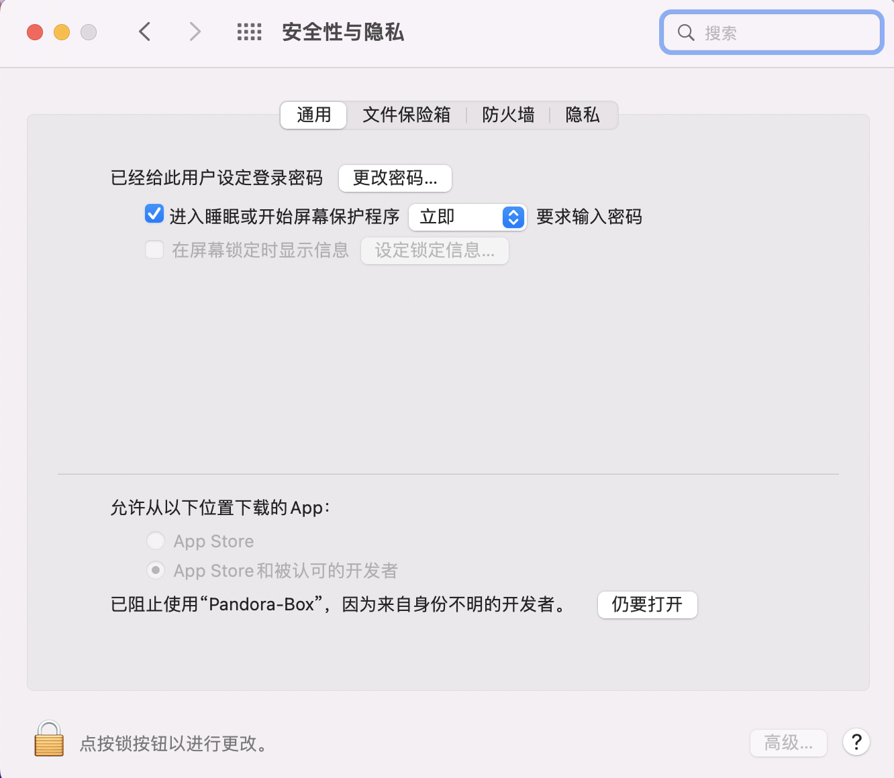
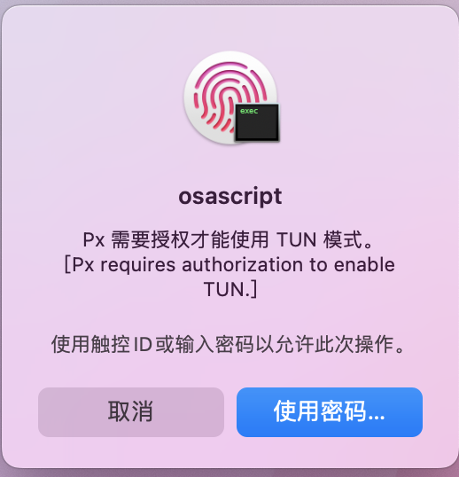

<h1>Mac 常见问题汇总</h1>

# 1、首次打开提示 “无法验证开发者”，解决办法
<br>
先点击取消<br>
然后 右上角苹果图标 --> 系统偏好设置 --> 安全性与隐私 --> 选择仍要打开
<br>

# 2、“无法验证开发者确定打开吗”，点击打开
<br>

# 3、提示 “Px 需要授权才能使用TUN模式”, 按需选择即可
<br>
**注意 若 点击取消，进入软件后不能开启 TUN** <br>

# 4、提示 “px 需要接入网络连接”, 点击允许
<br>

# 5、提示 软件损坏，解决办法
打开终端，输入以下命令，后面是app的具体路径，不知道？可以直接将app拖入终端即可看到路径

```shell
xattr -rd com.apple.quarantine Pandora-Box.app
```