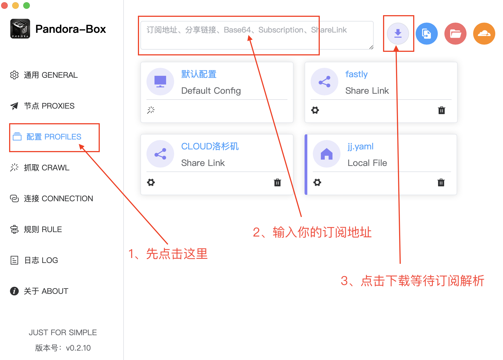
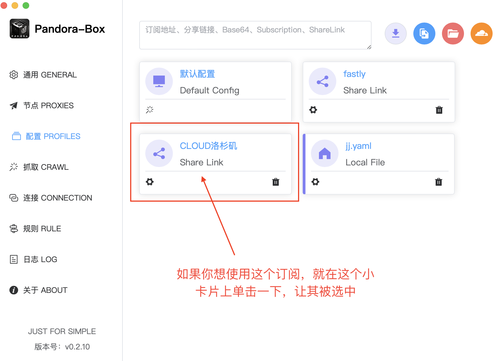
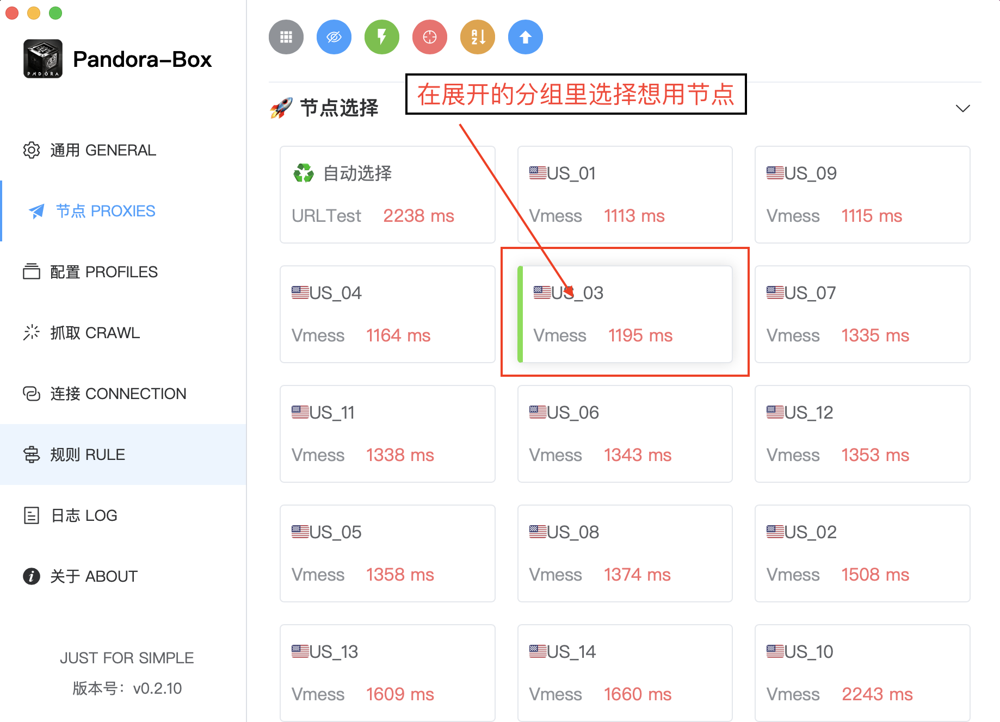
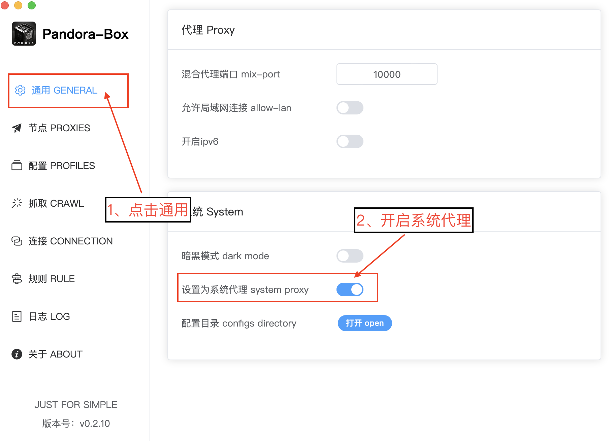
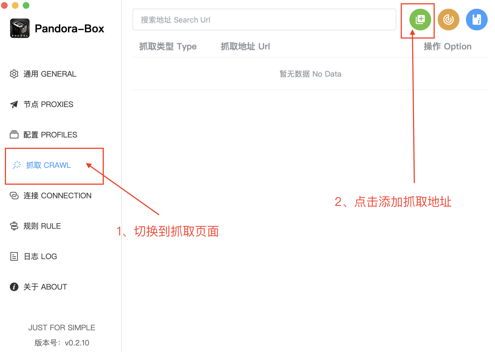
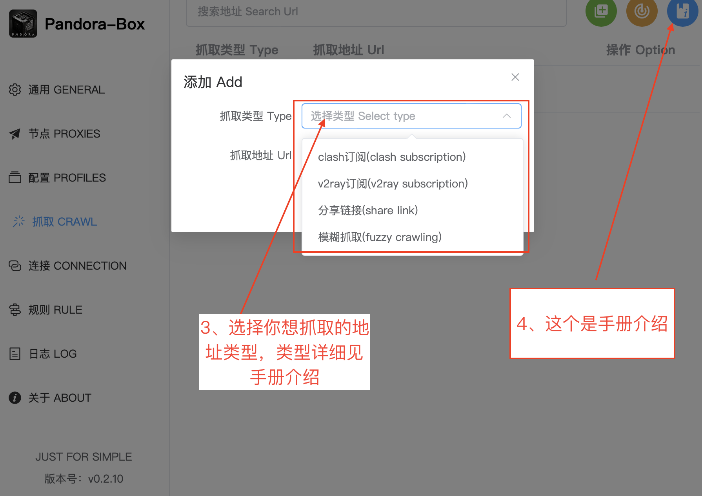
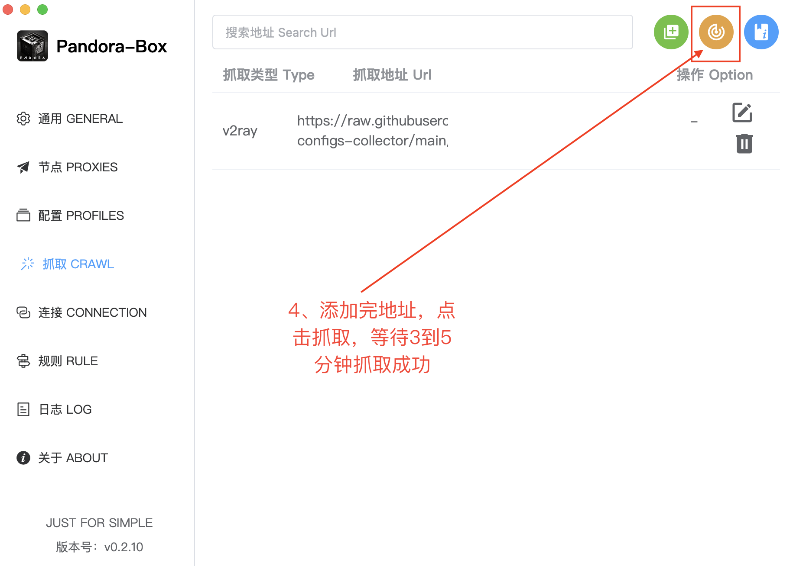
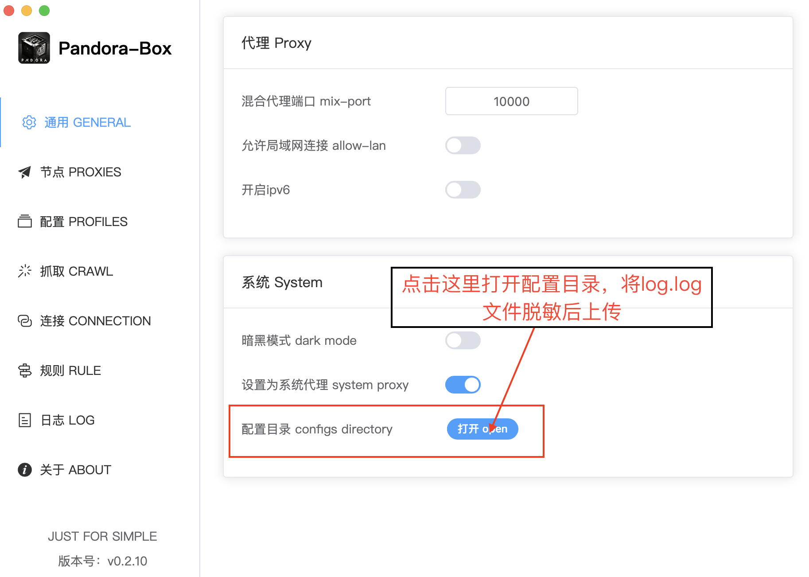

# Pandora-Box 基本使用

## 1、点击配置导入订阅
- 支持 clash、v2ray、sing-box订阅解析
- 支持 vless://... vmess://... hysteria2://... trojan://... 等分享链接，可多行，直接输入解析
- 支持 yaml、base64、json 直接输入解析

## 2、选择想用的配置点击

## 3、切换分组节点

## 4、开启系统代理
开启系统代理后，打开浏览器输入谷歌地址，页面可以显示出来就OK了

## 5、爬取使用
不知道选什么类型？ 
使用 **"自动识别"** 即可 
 爬取成功，回到配置页面，启用默认配置，即可使用爬取到的节点
  

## 6、出现问题提issue，上传日志文件

